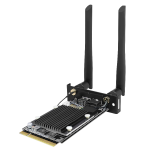

	
	

		
		
Der QuattroPod M1 ist der Empfänger, der sich in den SDM-Steckplatz (Intel® SDM-S) Ihres Displays einschieben lässt. Unterstützt werden alle Standard-, Mini- und USB-Sender in minimalistsicher und eleganter Empfänger-Form.

		
<a href="m1/intro">Zum QuattroPod M1</a>

	

